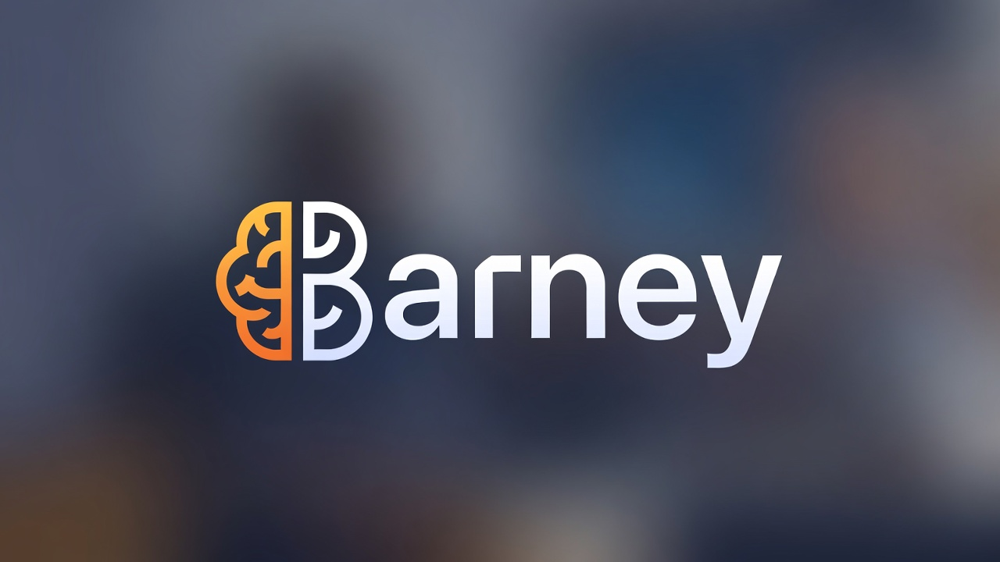
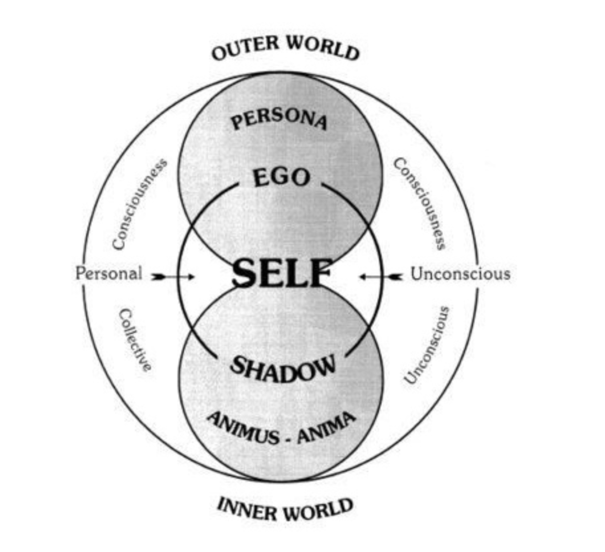
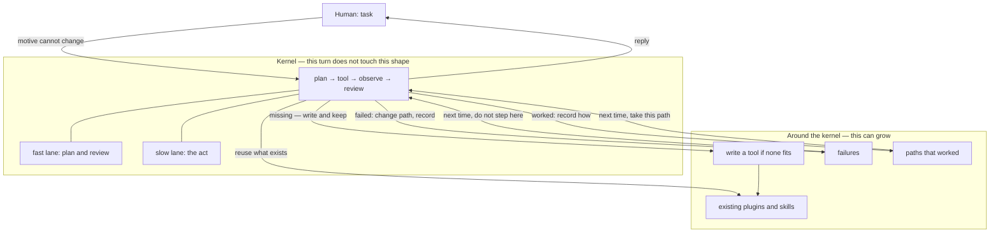

<p align="center">
  
</p>

## Barney Agent

**English** · [Русский](README.ru.md)

[](LICENSE)
[](https://github.com/sergey-show/barney/stargazers)

A self-developing agent.

This is an experimental agent project. Its core idea comes from Carl Jung — the [Self](https://en.wikipedia.org/wiki/Self_in_Jungian_psychology).



The name **Barney** is in memory of my dog.

The agent learns from its own experience — tasks that worked and tasks that failed.

It remembers that experience, can reuse it, and can draw connections.

It runs as a CLI or a WEB portal.

## Why this shape

Almost all “self-learning” is still mechanistic. The agent is given a hard role in advance (“who you are”). If a task fails, it rewrites its own code or a dynamic skill and spins that loop. That agent does not learn in the human sense. It does not understand why it failed — it retunes itself in the hope that a new configuration will work. A person who makes a mistake does not perform a lobotomy.

Barney is built the other way around. Existence precedes essence: an act first, then a line in the Self. The kernel keeps one turn shape — plan, tool, observe, review — and will not let the current task rewrite that shape. Around the kernel a new body grows: skills that already exist, a tool of its own if none fits, recorded failures (Shadow), recorded paths that worked (light).

Review looks at whether the **requested result** happened, not how confident the prose sounded. Persistence (wanting) is not the same as satisfaction (liking).


## Kernel and body



| Stays in `src/` | Lives in `~/.barney` |
|---|---|
| Turn loop, review, budgets, sandbox | Skills, plugins, MCP |
| Immune constitution | Self (compass, character, light, shadow) |
| Tool protocol | Notes, episodes, body git |

## Map

These names describe the runtime. They are not a hard role pasted into a system prompt.

| | In the runtime |
|---|---|
| **Self** | Character in action. Grows from deeds. Cannot be replaced wholesale. |
| **Ego** | This turn: plan, tools, observe, review. Center of the step, not of the whole. |
| **Persona** | The visible reply. A mask, not the center. |
| **Shadow** | Recorded failures. They are not overwritten until they are worked through. |
| **Motive / action / operation** | Why this session exists / what this step is / which tool runs. |
| **Wanting ≠ liking** | Keep going by changing path, not by hammering the same call. |
| **Two lanes** | Fast: plan and review. Slow: the act and, at idle, digesting experience. |

## Install

Needs [Bun](https://bun.sh) ≥ 1.2.

```bash
git clone https://github.com/sergey-show/barney.git
cd barney
bun install
```

Bind a model. Cloud keys are picked up on boot:

```bash
export ANTHROPIC_API_KEY=...     # or OPENAI_API_KEY, GROQ_API_KEY
```

Or any OpenAI-compatible server:

```bash
bun bin/barney-agent providers add --name local --host http://127.0.0.1:11434/v1 --use
bun bin/barney-agent providers use local --model <id-from-/v1/models>
```

## First run

```bash
bun run web          # portal → http://127.0.0.1:7331
bun run cli          # same kernel in the terminal
```

On first boot the instance is not designed yet. Setup is by points, or shortly **`canon`**.

After design, essence is written by deeds.

One-shot:

```bash
bun bin/barney-agent run "task"
```

WEB:

```bash
bun run build:web
bun run web
```

## Commands

| | |
|---|---|
| `barney web` | web-ui (`--port 7331`, `--host 127.0.0.1`) |
| `barney cli` | Interactive session |
| `barney run "<goal>"` | One shot |
| `barney providers ls` | LLM providers |
| `barney providers add --name … --host …` | add an OpenAI-compatible endpoint |
| `barney providers use <id> --model …` | Large model (coder) |
| `barney providers use <id> --model … --fast …` | Large + small (reviewer) |
| `barney agents ls` | Instances |

In `cli`: `/memory`, `/sessions`, `/work`, `/debug`, `/continue`, `/retry`, `/form`, `/quit`.

## Body

`~/.barney` is the body. Git there is the biography of becoming.

```
~/.barney/
  barney.sqlite      # agents, runs, memory
  self/              # Self
  skills/ plugins/ mcp/
  worktrees/         # per-run checkouts
```

## License

MIT. Copyright (c) 2026 Sergey Chugay.
