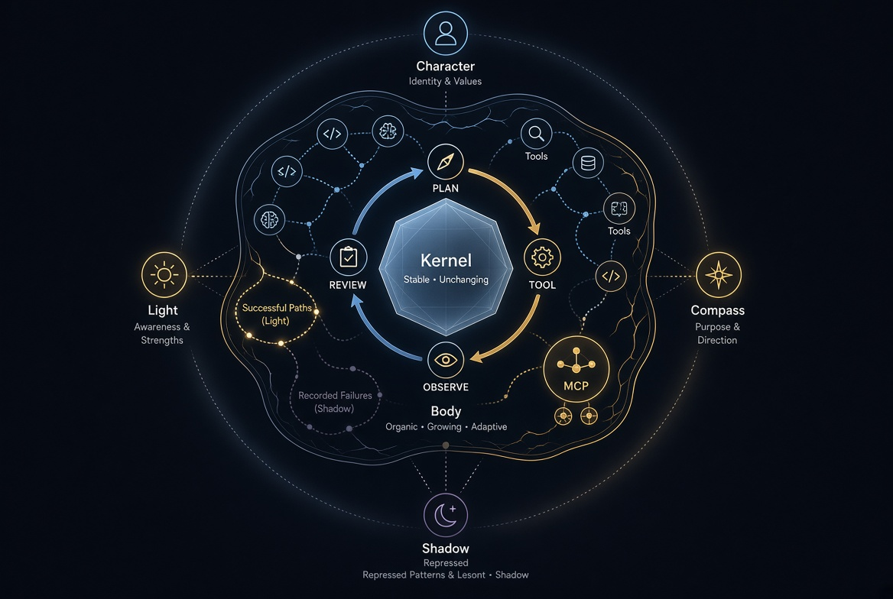
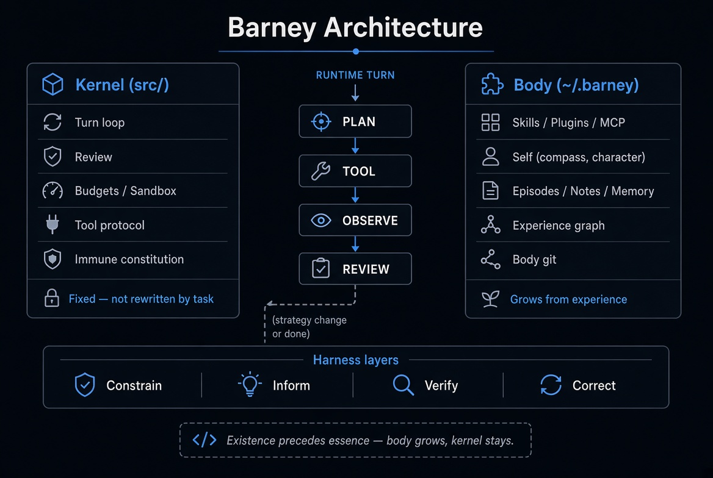

<p align="center">
  
</p>

## Barney Agent

**Русский** · [English](README.md)

[](LICENSE)
[](https://github.com/sergey-show/barney/stargazers)

Саморазвивающийся агент. 

Это эксперементальный проект агента, в основу агента вошла концепция Карла Юнга - [Самость](https://ru.wikipedia.org/wiki/Самость)


Имя **Barney** — в память о моей собаке.

Самообучения агента происходит на основе его опыта - успешных задач и неуспешных задач

Он запоминает опыт и мжет его переиспользвать, также может построить связь

Работает как CLI или WEB. 

## Зачем такая форма



Почти всё «самообучения» устроенно механистически. Агенту заранее пишут жёсткую роль («кто ты»). Если задача не получилась — он меняет свой код или динамический навык и крутит это по кругу. Такой агент не учится в человеческом смысле. Он не понимает причин неудачи — он подстраивается в надежде что новая конфигурация сработает. Человек же, ошибаясь, не делает себе лоботомию.

Barney собран иначе. Существование предшествует сущности: сначала поступок, потом строка в Самости. Ядро держит одну схему хода — план, инструмент, сверка, ревью — и не даёт текущей задаче эту схему переписать. Вокруг ядра растёт ноовая обвязка: уже существующие навыки, свой инструмент если готового нет, записанные провалы (Тень), записанные пути которые сработали (свет).

Ревью смотрит, **получен ли запрошенный результат**, а не насколько уверенно написан текст. Упорство (wanting) не равно удовлетворению (liking).

Также агент следует четырём слоям обвязки вокруг модели. 


|               |                                                                                        |
| ------------- | -------------------------------------------------------------------------------------- |
| **Constrain** | Песочница, бюджет, повтор того же вызова. Физически нельзя, а не «строго запрещено».   |
| **Inform**    | Закон хода, факты сессии, уроки, Самость. Код собирает, что видно модели на этом шаге. |
| **Verify**    | Ревью смотрит на результат (файл, запуск, секрет, URL), не на уверенный текст.         |
| **Correct**   | Сменить семейство инструмента, записать урок. Не долбить тот же вызов.                 |


## Ядро и тело




| Остаётся в `src/`                    | Живёт в `~/.barney`                    |
| ------------------------------------ | -------------------------------------- |
| Цикл хода, ревью, бюджеты, песочница | Навыки, плагины, MCP                   |
| Иммунная конституция                 | Самость (компас, характер, свет, тень) |
| Протокол инструментов                | Заметки, эпизоды, git тела             |


## Карта

Эти имена описывают рантайм. Это не заложенная роль, которую вставляют в системный промпт.


|                                 | В рантайме                                                                |
| ------------------------------- | ------------------------------------------------------------------------- |
| **Самость**                     | Характер в действии. Растёт из поступков. Её нельзя заменить целиком.     |
| **Эго**                         | Этот ход: план, инструменты, сверка, ревью. Центр шага, не всей личности. |
| **Персона**                     | Видимый ответ. Маска, не центр.                                           |
| **Тень**                        | Зафиксированные ошибки. Их не затирают, пока не переработают.             |
| **Мотив / действие / операция** | Зачем сессия / что делаем сейчас / какой инструмент.                      |
| **Wanting ≠ liking**            | Продолжать — сменив путь, а не используя все тот же вызов.                        |
| **Сон**                         | В простое сырая Тень сжимается в несколько эвристик . |
| **Фрустрация**                  | Много провальных путей → стоп и запрос смены парадигмы, с именем застрявшей Тени. |
| **Всплытие Тени**               | Похожие прошлые провалы поднимаются до акта (эмбеддинги). |
| **Проверенный навык**           | Навык пишется только после сработавшего recovery — не выдумывается посреди промаха. |
| **Сначала анализ, потом план**  | Одна модель: что должно стать истиной, затем шаги, затем акт и ревью.     |


## Установка

Тело агента всегда в `~/.barney`. Ядро можно поставить тремя путями.

### npm

Нужен [Bun](https://bun.sh) ≥ 1.4.

```bash
bun add -g @encsch/barney
barney web
```

Либо `npm install -g @encsch/barney` — на `PATH` всё равно должен быть `bun` (скрипт запускается через него).

### Релиз с GitHub

Скачайте файл под свою платформу с 
[Releases](https://github.com/sergey-show/barney/releases/latest):

| Файл | Платформа |
|---|---|
| `barney-darwin-arm64` | macOS Apple Silicon |
| `barney-darwin-x64` | macOS Intel |
| `barney-linux-x64` | Linux x64 |
| `barney-linux-arm64` | Linux ARM64 |
| `barney-windows-x64.exe` | Windows x64 |

```bash
curl -L -o barney https://github.com/sergey-show/barney/releases/latest/download/barney-darwin-arm64
chmod +x barney
./barney web
```

### Из исходников

Нужен [Bun](https://bun.sh) ≥ 1.4.

```bash
git clone https://github.com/sergey-show/barney.git
cd barney
bun install
bun run build:web
bun run web            # портал → http://127.0.0.1:7331
bun run cli
bun bin/barney run "задача"
```

Свой бинарник: `bun run build:bin` → `./dist/barney`.

## Первый запуск

Привяжите модель. Облачные ключи подхватываются при загрузке:

```bash
export ANTHROPIC_API_KEY=...     # или OPENAI_API_KEY, GROQ_API_KEY
barney providers add --name local --host http://127.0.0.1:11434/v1 --use
barney providers use local --model <id-из-/v1/models>
```

При первом старте экземпляр ещё не спроектирован. Инициализация по пунктам или коротко **`канон`**. После проектирования сущность пишется поступками.


## Команды


|                                          |                                            |
| ---------------------------------------- | ------------------------------------------ |
| `barney web`                             | web-ui (`--port 7331`, `--host 127.0.0.1`) |
| `barney acp`                             | ACP v1-агент через stdio                    |
| `barney cli`                             | Интерактивная сессия                       |
| `barney run "<цель>"`                    | Один прогон                                |
| `barney providers ls`                    | Список провайдеров LLM                     |
| `barney providers add --name … --host …` | добавить OpenAI-совместимый endpoint       |
| `barney providers use <id> --model …`    | Привязать модель (план, акт, ревью)        |
| `barney agents ls`                       | Экземпляры                                 |


Интерактивный CLI использует ту же границу сессий, что и Web. Полный список
показывает `/help`; основные сценарии: `/new`, `/sessions [запрос]`,
`/open <id>`, `/memory [запрос]`, `/note <ключ>`, `/work`, `/status`,
`/continue`, `/retry`. Ctrl+C останавливает активный шаг, не закрывая CLI.

## ACP

Barney предоставляет IDE тот же локальный жизненный цикл сессии через
стабильный ACP v1. Укажите в ACP-клиенте команду `barney-agent` либо запустите
`barney acp` напрямую. Транспорт — JSON-RPC 2.0 через stdio: сетевой listener и
hosted-сервис не запускаются. Первый prompt создаёт Barney-run в `cwd` клиента,
следующие продолжают его, а отмена использует тот же runtime-путь, что Web и CLI.

## Тело

`~/.barney` — это тело, там — биография становления.

```
~/.barney/
  barney.sqlite      # агенты, прогоны, память
  self/              # Самость
  skills/ plugins/ mcp/
  worktrees/         # checkout на каждый прогон
```

## Документация

Как растёт тело — инструменты, плагины, MCP. Русский и английский.

| | |
|---|---|
| [Документация](docs/README.ru.md) | Оглавление |
| [Инструменты](docs/tools.ru.md) | Протокол tools ядра |
| [Плагины](docs/plugins.ru.md) | Навыки и UI в `~/.barney` |
| [MCP](docs/mcp.ru.md) | Локальные stdio-серверы, которые агент может поднять сам |

[English](docs/README.md)

## Лицензия

MIT. Copyright (c) 2026 Sergey Chugay.