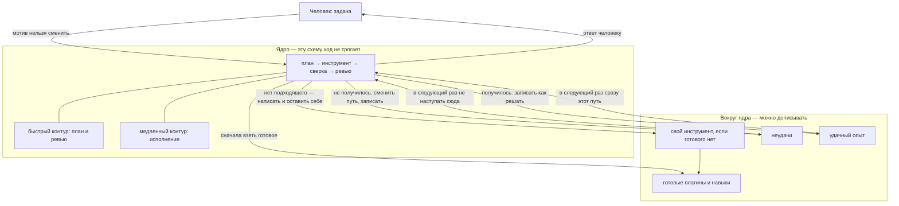

<p align="center">
  
</p>

## Barney Agent

**Русский** · [English](README.md)

[](LICENSE)
[](https://github.com/sergey-show/barney/stargazers)

Саморазвивающийся агент. 

Это эксперементальный проект агента, в основу агента вошла концепция Карла Юнга - [Самость](https://ru.wikipedia.org/wiki/Самость)


Имя **Barney** — в память о моей собаке.

Самообучения агента происходит на основе его опыта - успешных задач и неуспешных задач

Он запоминает опыт и мжет его переиспользвать, также может построить связь

Работает как CLI или WEB. 

## Зачем такая форма

Почти всё «самообучения» устроенно механистически. Агенту заранее пишут жёсткую роль («кто ты»). Если задача не получилась — он меняет свой код или динамический навык и крутит это по кругу. Такой агент не учится в человеческом смысле. Он не понимает причин неудачи — он подстраивается в надежде что новая конфигурация сработает. Человек же, ошибаясь, не делает себе лоботомию.

Barney собран иначе. Существование предшествует сущности: сначала поступок, потом строка в Самости. Ядро держит одну схему хода — план, инструмент, сверка, ревью — и не даёт текущей задаче эту схему переписать. Вокруг ядра растёт ноовая обвязка: уже существующие навыки, свой инструмент если готового нет, записанные провалы (Тень), записанные пути которые сработали (свет).

Ревью смотрит, **получен ли запрошенный результат**, а не насколько уверенно написан текст. Упорство (wanting) не равно удовлетворению (liking).


## Ядро и тело



| Остаётся в `src/` | Живёт в `~/.barney` |
|---|---|
| Цикл хода, ревью, бюджеты, песочница | Навыки, плагины, MCP |
| Иммунная конституция | Самость (компас, характер, свет, тень) |
| Протокол инструментов | Заметки, эпизоды, git тела |

## Карта

Эти имена описывают рантайм. Это не заложенная роль, которую вставляют в системный промпт.

| | В рантайме |
|---|---|
| **Самость** | Характер в действии. Растёт из поступков. Её нельзя заменить целиком. |
| **Эго** | Этот ход: план, инструменты, сверка, ревью. Центр шага, не всей личности. |
| **Персона** | Видимый ответ. Маска, не центр. |
| **Тень** | Зафиксированные ошибки. Их не затирают, пока не переработают. |
| **Мотив / действие / операция** | Зачем сессия / что делаем сейчас / какой инструмент. |
| **Wanting ≠ liking** | Продолжать — сменив путь, а не долбя тот же вызов. |
| **Два контура** | Быстрый: план и ревью. Медленный: акт и в простое — разбор опыта. |

## Установка

Нужен [Bun](https://bun.sh) ≥ 1.4.

```bash
git clone https://github.com/sergey-show/barney.git
cd barney
bun install
```

Привяжите модель. Облачные ключи подхватываются при загрузке:

```bash
export ANTHROPIC_API_KEY=...     # или OPENAI_API_KEY, GROQ_API_KEY
```

Или любой OpenAI-совместимый сервер:

```bash
bun bin/barney-agent providers add --name local --host http://127.0.0.1:11434/v1 --use
bun bin/barney-agent providers use local --model <id-из-/v1/models>
```

## Первый запуск

```bash
bun run web          # портал → http://127.0.0.1:7331
bun run cli          # то же ядро в терминале
```

При первом старте экземпляр ещё не спроектирован. Происходит инициализация по пунктам или коротко **`канон`**.

После проектирования сущность пишется поступками.

Еденичный запуск:

```bash
bun bin/barney-agent run "задача"
```

WEB:

```bash
bun run build:web
bun run web
```

## Команды

| | |
|---|---|
| `barney web` | web-ui (`--port 7331`, `--host 127.0.0.1`) |
| `barney cli` | Интерактивная сессия |
| `barney run "<цель>"` | Один прогон |
| `barney providers ls` | Список провайдеров LLM |
| `barney providers add --name … --host …` | добавить OpenAI-совместимый endpoint |
| `barney providers use <id> --model …` | Большая модель (coder) |
| `barney providers use <id> --model … --fast …` | Большая + малая (reviewer) |
| `barney agents ls` | Экземпляры |

В `cli`: `/memory`, `/sessions`, `/work`, `/debug`, `/continue`, `/retry`, `/form`, `/quit`.

## Тело

`~/.barney` — это тело, там — биография становления.

```
~/.barney/
  barney.sqlite      # агенты, прогоны, память
  self/              # Самость
  skills/ plugins/ mcp/
  worktrees/         # checkout на каждый прогон
```

## Лицензия

MIT. Copyright (c) 2026 Sergey Chugay.
